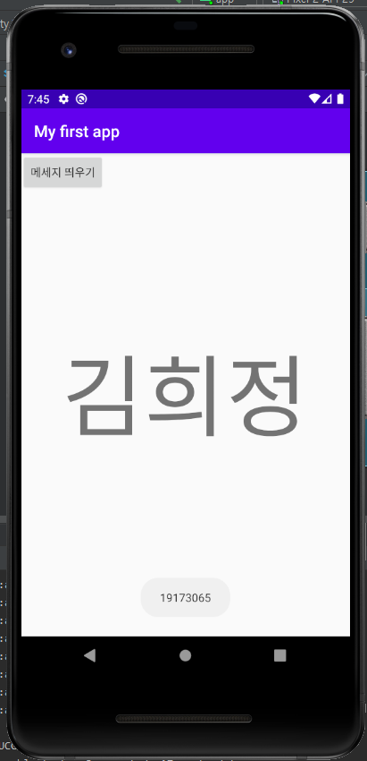
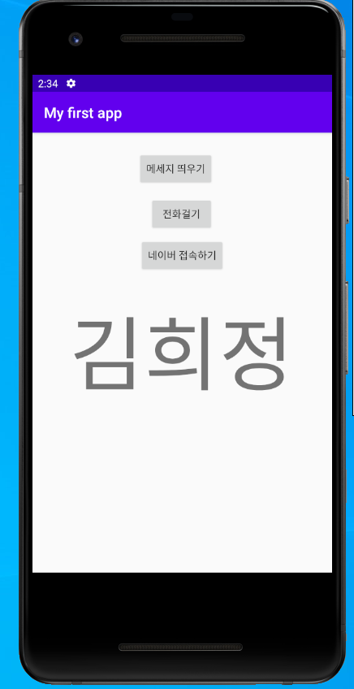

# My-Frist-Repository
Hello my name is heejung
## 19173065 김희정
### 2주차 과제
   </img>
### 3주차 과제
  </img>
### 4주차 과제

  - 편리한 병원생활 위한 앱 : 대학병원 혹은 큰 병원의 복잡한 접수와 긴 대기시간을 해결할 수 있는 모바일 대기표 기능을 추가하여 
                            해당병원의 앱 사용률의 증가와 동시에 원활한 접수를 통해 서비스 개선이 가능하다. 가벼운 진료는 진료예약
                            을 통해 예약할 수 있고 입원, 퇴원 혹은 보험서류 출력 등 복잡한 절차는 모바일로 대기표를 받아 실시간으로
                            대기표 진행절차 또한 볼 수 있도록 한다. 부가적인 기능으로는 회원가입을 통해 회원들의 개인 건강정보(수치) 등을
                            손쉽게 볼 수 있으며, 내가 복용하고 있는 약의 정보도 확인할 수 있다.
            
### 7주차 과제
